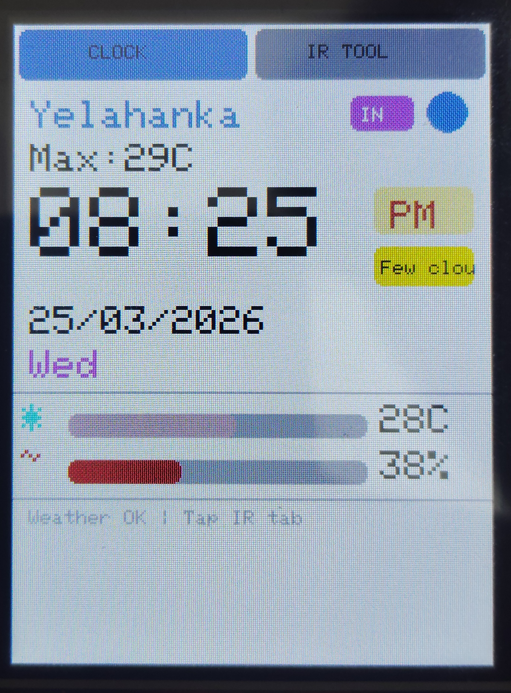
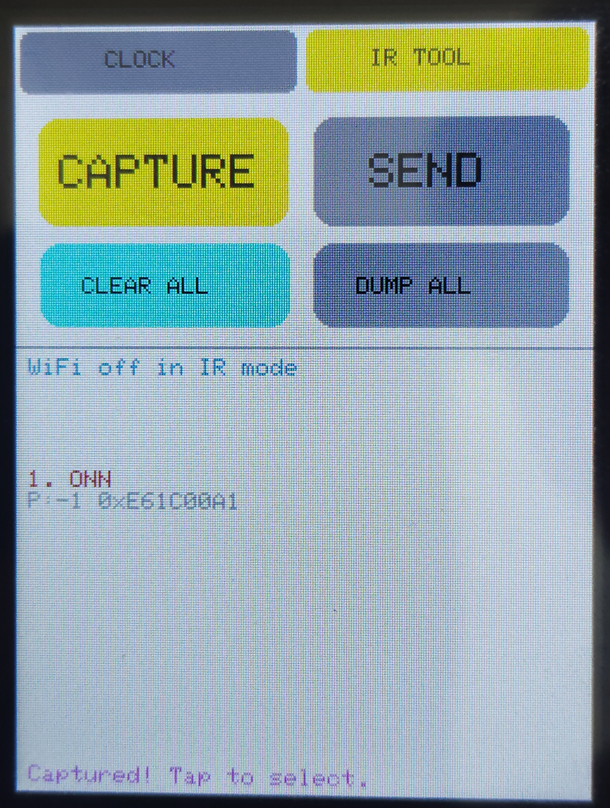
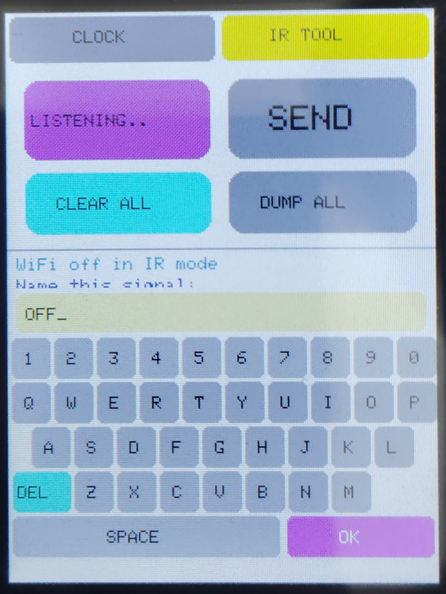

# IoT Smart-Station & IR Command Center 🌦️📡

A high-performance desktop companion built on the **ESP8266**. This project features an intelligent context-switching system that toggles between network-heavy tasks (Weather/NTP) and timing-critical hardware tasks (IR Cloning).

## 📸 Interface Preview

| 1. Dashboard Mode | 2. IR Control Mode | 3. Naming Signal |
| :--- | :--- | :--- |
|  |  |  |
| *Real-time Weather & NTP Clock* | *Cloning & hardware control* | *Custom HMI Touch Keyboard* |

## 🚀 Key Features
* **Context-Aware Resource Management:** The system deactivates the WiFi stack during IR capture to eliminate CPU interrupts, ensuring microsecond precision for decoding IR protocols (NEC, Samsung, Sony).
* **On-Screen HMI Keyboard:** A custom-coded QWERTY touch interface allows for naming captured IR signals directly on the device.
* **Non-Volatile Storage (SPIFFS):** Uses the ESP8266's internal Flash memory to store captured signals, ensuring data persists after a reboot.
* **Dynamic Weather Engine:** Fetches live data (Temp, Humidity, Conditions) from OpenWeatherMap API with 10-minute refresh intervals and NTP time sync.

## 🛠️ Tech Stack
- **Microcontroller:** ESP8266 (NodeMCU)
- **Display:** 2.4" TFT LCD (ILI9341) using `TFT_eSPI`
- **Peripherals:** IR Receiver (TSOP), IR Transmitter LED
- **Logic:** REST API integration, JSON parsing, SPIFFS File Management.

## 🔧 Installation & Setup
1.  **Hardware:** Connect components as per the code's defined GPIO pins.
2.  **Configuration:** * Rename `config.h.example` to `config.h`.
    * Enter your WiFi credentials and OpenWeatherMap API Key.
3.  **Calibration:** On first boot, the system triggers a touch calibration. Results are saved to `/touch.cal` in SPIFFS.

## 🔌 Hardware Connections & Pinout

This project uses a 2N2222A NPN transistor as a high-current switch to drive the IR LED for maximum range without damaging the ESP8266 GPIO pins.

| Component | Pin Name | ESP8266 Pin | Notes |
| :--- | :--- | :--- | :--- |
| **TFT Display** | VCC / LED | **3V3** | Main Power (3.3V) |
| | GND | **GND** | Common Ground |
| | CS | **D8 (GPIO 15)** | Chip Select |
| | DC / RS | **D3 (GPIO 0)** | Data/Command |
| | SDI (MOSI) | **D7 (GPIO 13)** | SPI Data Out |
| | SCK (CLK) | **D5 (GPIO 14)** | SPI Clock |
| **IR Receiver** | Data Out | **D4 (GPIO 2)** | Signal Input |
| | VCC / GND | **3V3 / GND** | Power Rails |
| **IR Transmitter**| **Base** | **D1 (GPIO 5)** | **Signal Out (via 220Ω Resistor)** |
| **(2N2222A)** | **Emitter** | **GND** | Transistor Ground |
| | **Collector** | **IR LED (-)** | Connected to LED Cathode |
| **IR LED** | Anode (+) | **3V3** | Connected to 3.3V Rail |

## 📄 License
This project is licensed under the **MIT License**.

---
**Developed by [Rithwik Nambiar](https://github.com/rithwik-nambiar)** *Aspiring Embedded Systems Engineer | Presidency University, Bangalore*
